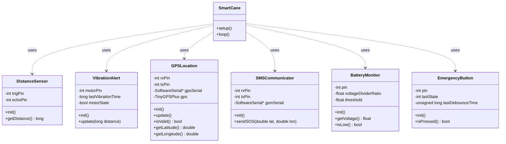

# Software Architecture

The Smart Cane software follows a modular object-oriented architecture. Each hardware component is encapsulated in its own class, abstracting the low-level hardware interactions from the main logic.

## Class Diagram

## Modules Description

- **Sensors**:
    - `DistanceSensor`: Handles HC-SR04 ultrasonic sensor readings.
    - `BatteryMonitor`: Reads battery voltage via a voltage divider.
    - `EmergencyButton`: Handles button input with debouncing.
- **Actuators**:
    - `VibrationAlert`: Controls the vibration motor with variable frequency based on distance.
- **Communication**:
    - `GPSLocation`: Manages the NEO6M GPS module to retrieve coordinates.
    - `SMSCommunicator`: Manages the SIM800L module to send SOS messages.
- **Config**:
    - `Config.h`: Central configuration file for pins and constants.
